# fpga-vga-controller
VGA display controller written in Verilog-2001 and tested in the Alhambra II FPGA board. This is my first project with an HDL and FPGA.

I used the [VESA standard document](doc/VESA-DMT-1.12.pdf) in the 1.0.12 version of 2008 as a reference for the timings.

I implemented three variations of the 640x480@60Hz resolution at 1, 2 and 3 bpp. The buttons in the board can be used to change from one controller to another.


## The circuit
To output the RGB analog signals I don't use a DAC, instead I simulate an 1-bit DAC by using digital signals directly. This reduces the number of colors to eight (2 possible values for 3 colors).

The VGA standard needs a 0V to 0.7V signal in the pins R, G and B. In order to get this voltage you need to use a 270 ohms or greater resistor if you use a 3.3V digital pin for the outputs. I am using 330 ohms resistors because I don't have 270 ohms resistors and therefore my output colors are less saturate. The rest of the pins are digital, so I connect it to 3.3V pins of my board.

The connections from one male end of the wire to the board are these:
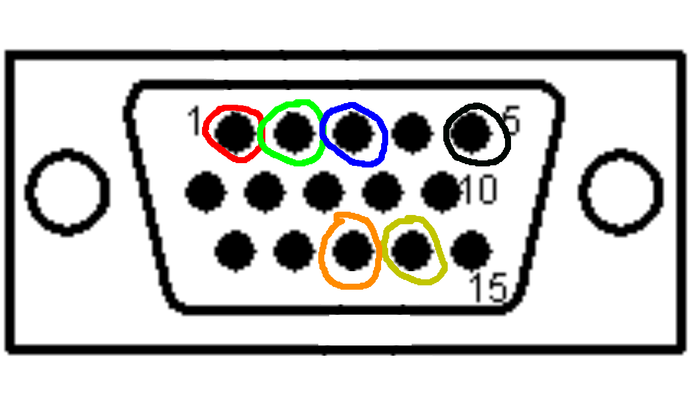
* Pin 1 (red circle) to the red pin of the board in series with one resistor
* Pin 2 (green circle) to the green pin of the board in series with one resistor
* Pin 3 (blue circle) to the blue pin of the board in series with one resistor
* Pin 5 (black circle) to the GND pin of the board
* Pin 13 (orange circle) to the hsync pin of the board
* Pin 14 (yellow circle) to the vsync pin of the board

Here are the pictures of all the connections:
<details close>
  <summary>Connections (click to see)</summary>

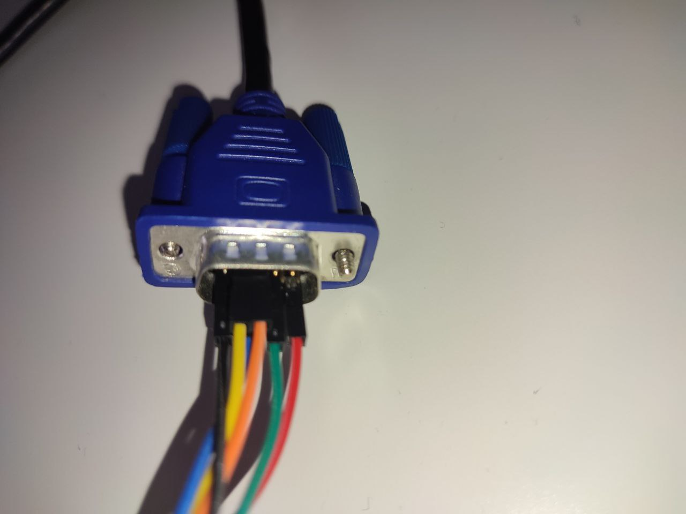
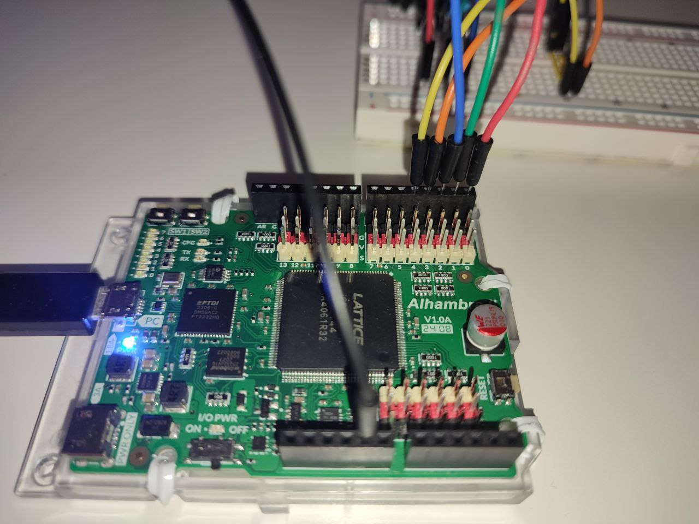
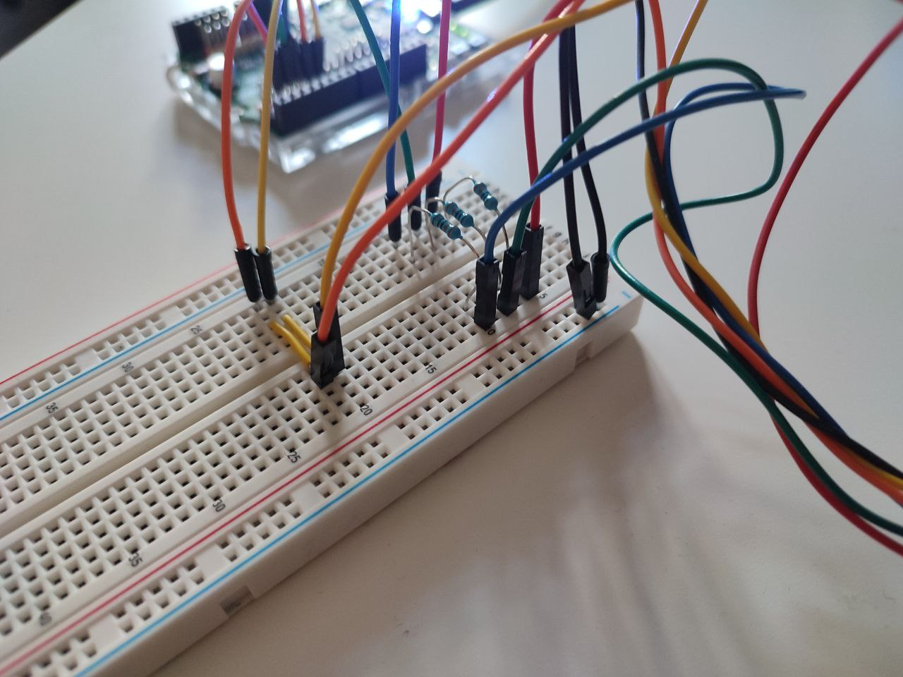
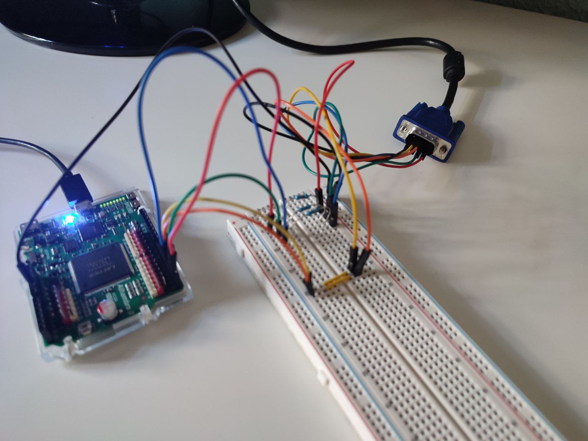

</details>

Once connected, the buttons on the board can be used to change from one video mode to another: 

<details close>
  <summary>Buttons on the board (click to see)</summary>


</details>


## Demonstration

I tested the controller with a Samsung TV and an LG monitor in the three video modes:

#### Samsung tv 640x480@60Hz 1bpp mode:
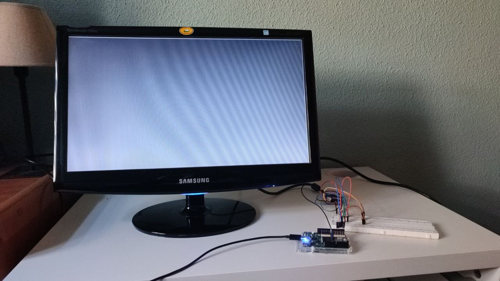

#### Samsung tv 640x480@60Hz 2bpp mode:
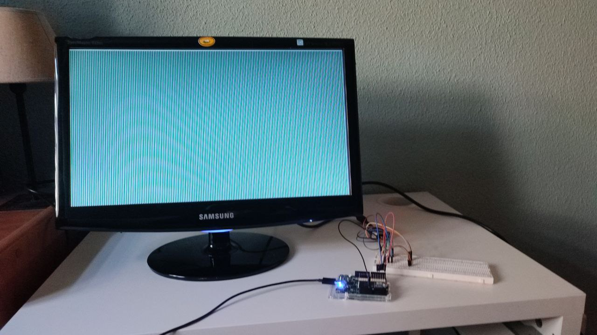

#### Samsung tv 640x480@60Hz 3bpp mode:
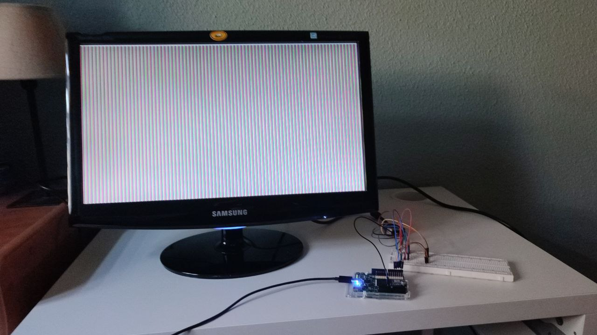

#### LG monitor 640x480@60Hz 1bpp mode:


#### LG monitor 640x480@60Hz 2bpp mode:
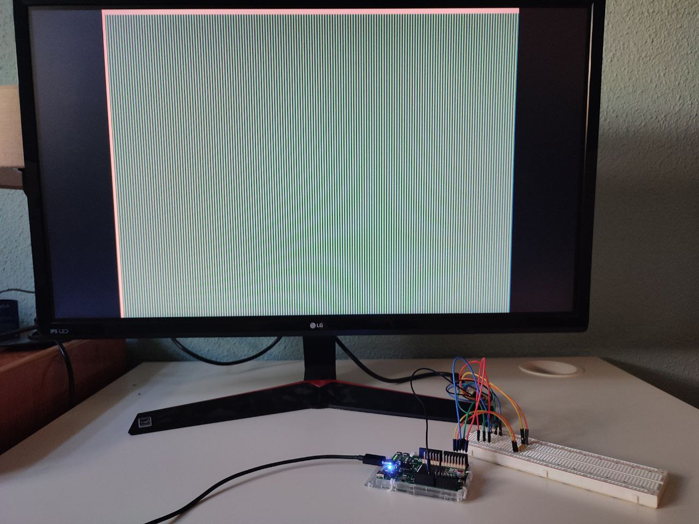

#### LG monitor 640x480@60Hz 3bpp mode:
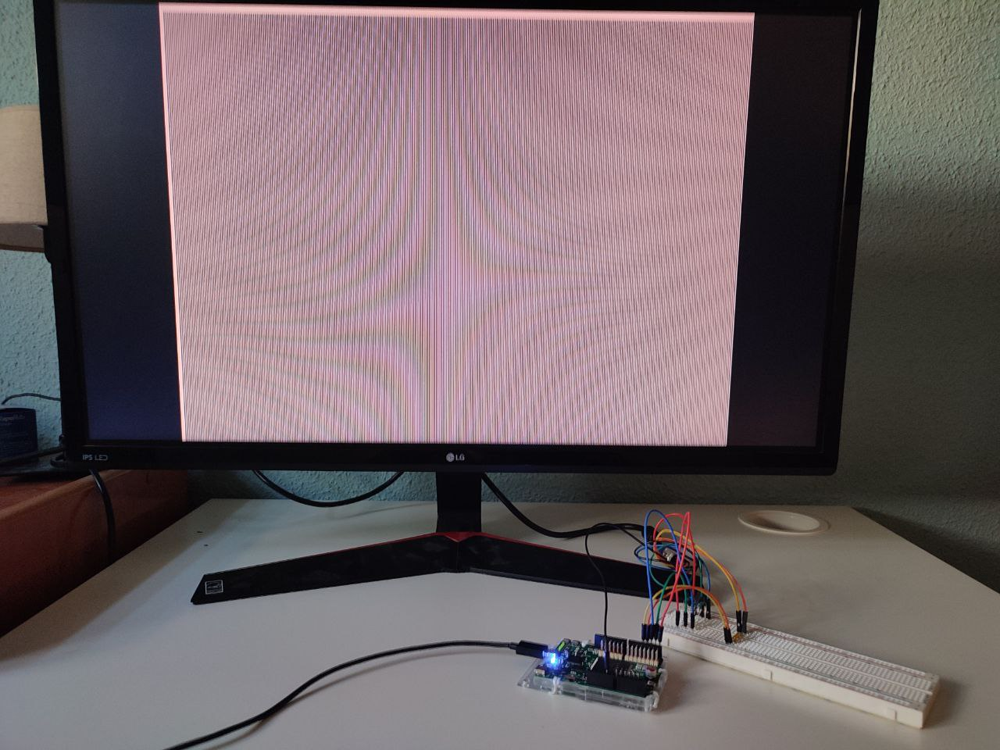


For test purposes I printed the border pixels in white and realize that each display follow different rules to print the border pixels. 

In the case of the Samsung TV, the image is displaced 2 pixels to the bottom, and are fine horizontally.

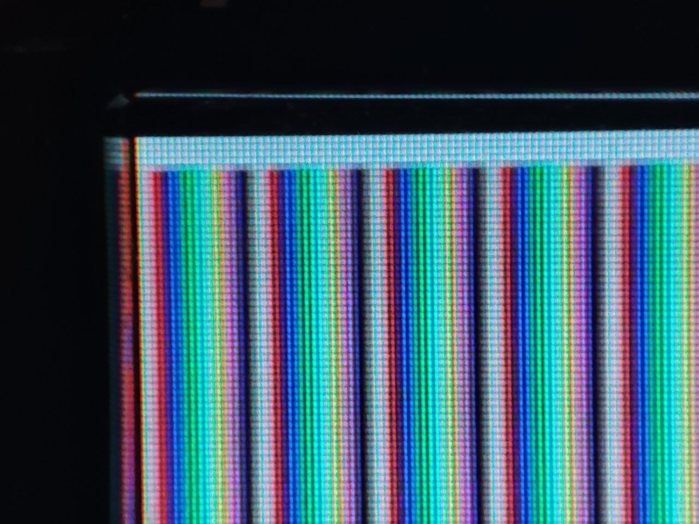

In the case of the LG monitor, the image is displaced 4 pixels to the right and 6 pixels to the bottom. 

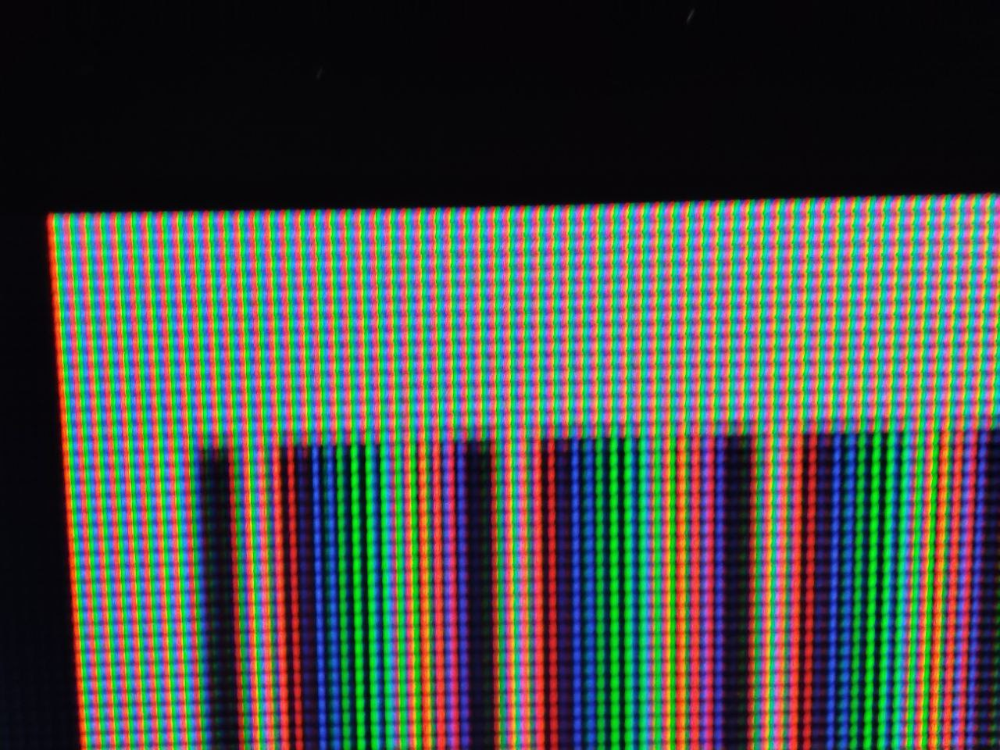

I don't know if this is a configuration problem of the displays or a problem in my design, but the displacement is different in both.


## Test benches

Requirements:
* iverilog
* gtkwave

There are two test benches, one for the top module to test all design, and other for the palette module to test that the contents of the palette ROM are correct.

You can run the top test bench by typing on the root of the project:
```
make sim
```
and the palette test bench by typing:
```
make sim_palette
```


## Synthesizing

Requirements:
* Alhambra II board (probably you can use other board by changing the pcf file and the PLL configuration)
* yosys
* nextpnr
* icestorm


To synthesize, type on the root of the project:
```
make synt
```
And to flash on the board:
```
make flash
```